# LedClock-AIO (All In One)

   

A **~100x33mm** version of the **[ledclock](https://github.com/imeszaros/ledclock)** project by [imeszaros](https://github.com/imeszaros), powered by [WLED](https://github.com/wled/WLED). 

It tells the time, it changes colors, and it never asks you to update it at 3 AM. Well ... almost never.

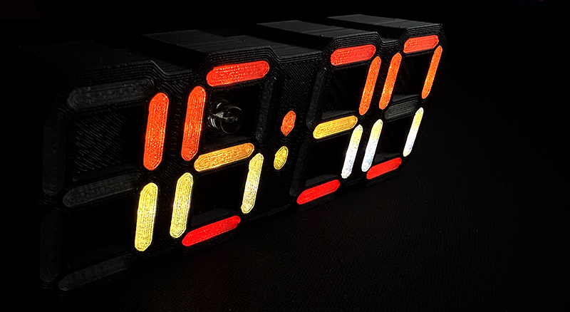

## Description and features 

This version takes an **ALL IN ONE** (AIO) approach to the **[ledclock](https://github.com/imeszaros/ledclock)** project: one PCB, no extra modules, no wires hiding inside the case.

- **99.74x33.2mm PCB** - deliberately kept under 100mm, because PCB fabs charge extra for every millimeter past that, and that money is better spent on filament.
- **USB-C powered** - one cable and you're done. No barrel jacks, no mystery power bricks from the drawer.
- **Hand-solderable** - some footprints were modified specifically to make hand soldering possible.

That said, I still strongly recommend **ordering a stencil**, at least for the FRONT of the PCB (where the LEDs are). Hand soldering all those LEDs one by one is technically possible (the same way walking to the seaside is technically possible).

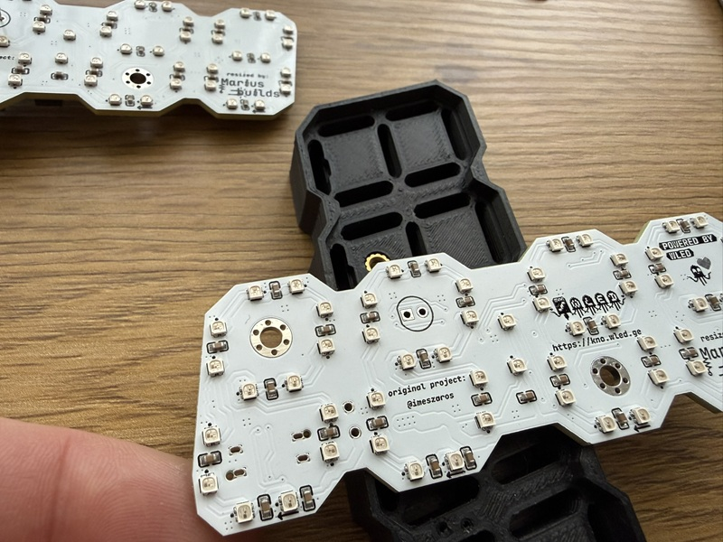

The **schematic** also includes some cheaper alternatives for the photosensitive sensor and the potentiometer. You can find them on [lcsc.com](https://www.lcsc.com/) by searching the part number listed below each one (e.g. C242253 for the photosensitive sensor alternative). **The alternative parts are not included in the BOM, to avoid confusion.** One BOM, one truth.

## LEDs alternatives 

You can also use [WS2812B-2020](https://www.lcsc.com/product-detail/C965555.html) LEDs (a bit more expensive) or [TCWIN TX1812ZN](https://www.lcsc.com/product-detail/C784563.html) (a little bit bigger). Keep in mind that you have to **double/triple check the pin orientation**, since the silkscreen marks don't match. Soldering 50+ LEDs backwards is a lesson you only want to learn once.

## Assembly instructions and tips

After finishing the top side, move on to the bottom side, and pay special attention to these two parts:

- **The photoresistive sensor** must be soldered **5–7 mm above the top layer of the PCB**, so it sticks out through the case. Otherwise your clock will think it's permanently night and dim itself into depression.

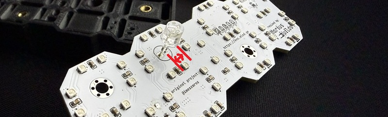
  
- **The C3 capacitor (1000 µF)** must be **mounted horizontally**, as shown in the image below. Standing up, it won't fit in the case, no matter how hard you push (please don't push).

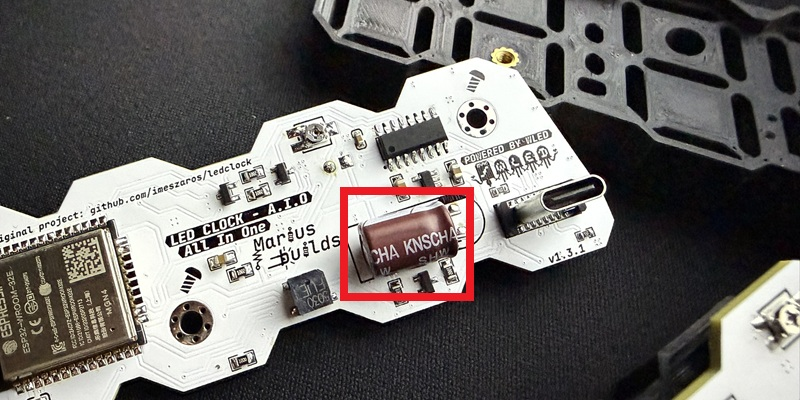

## Case 

Print the case files from the **CaseModel** folder of this repository in whatever colors you like. The files are also available on Printables: https://www.printables.com/model/1087560-led-clock-all-in-one-pcb-powered-by-wled

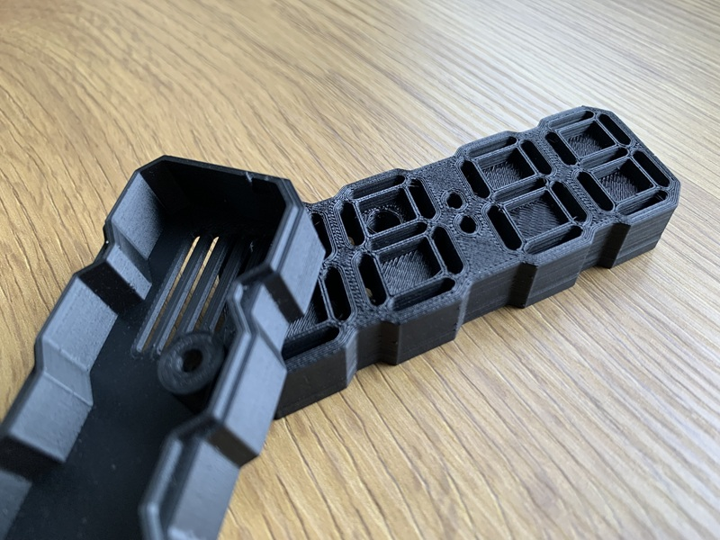

You will also need **two M3 heat inserts** and **two M3x8mm countersunk screws**.

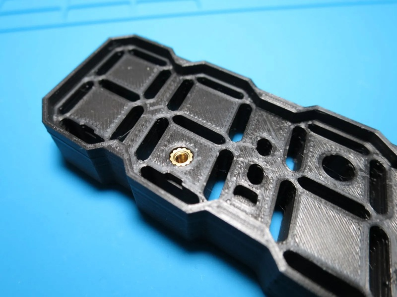

The segment covers need to be printed with **transparent filament, 20–30% infill and 2–3 top/bottom layers**. Depending on how accurate your printer is, you might want to print the offset segments file instead (0.1mm smaller), because not all printers are created equal and some are more "creative" than others.

**Pro tip:** to keep track of them, put masking tape over the segments before removing them from the build plate, then put a piece of kitchen stretch film over the tape. Otherwise you'll spend the next hour playing a very boring puzzle game.

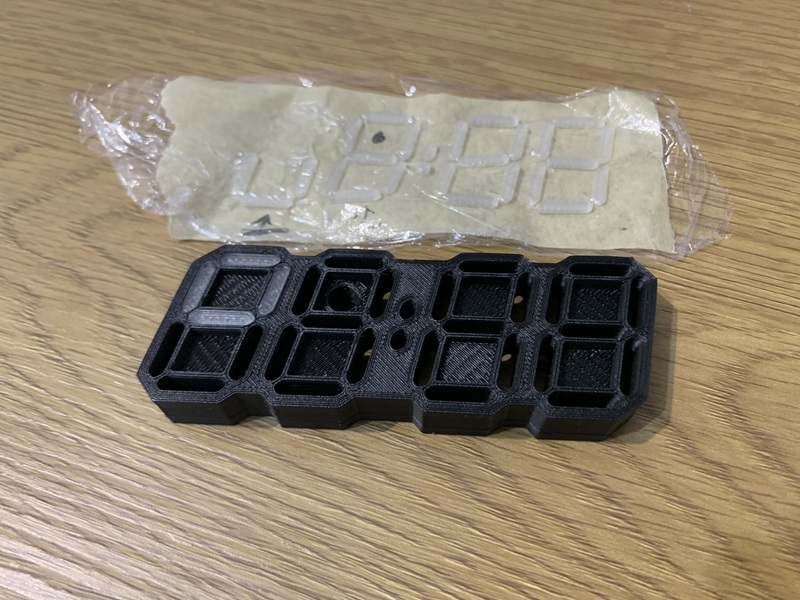

If the tolerances are too tight and the segment covers won't go in, a small hammer and some gentle "tapping" will convince them :)). Gentle being the key word here: we're assembling a clock, not building a deck.

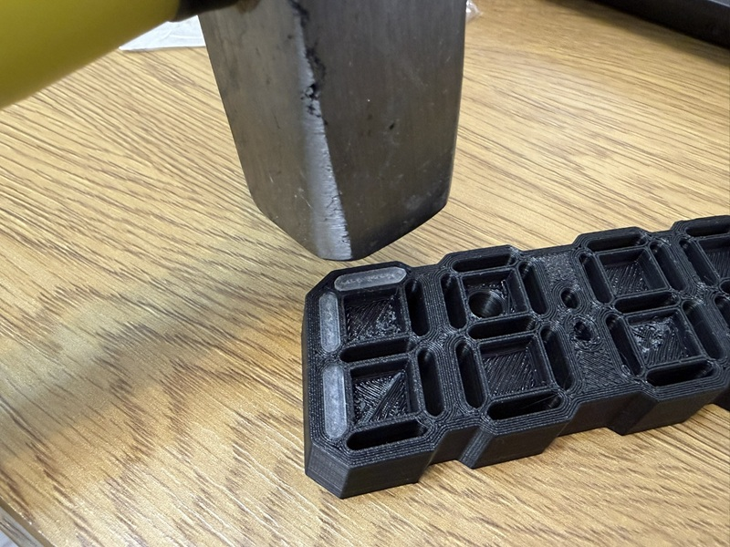 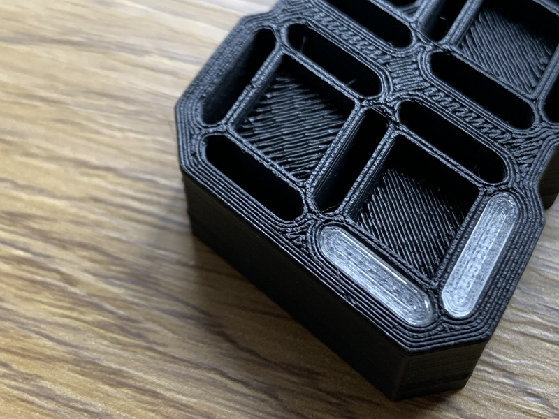

## Firmware 

The firmware comes from the awesome work of [imeszaros](https://github.com/imeszaros), so all the credit for the smart part goes to him.

1. **Install the CH340 drivers** BEFORE connecting the clock, otherwise your computer will politely pretend nothing is plugged in.
2. Connect the LED Clock to your computer and use [this tool](https://imeszaros.github.io/ledclock/) to flash the board (make sure you select the correct COM port).
3. Download the WLED app on your phone and connect to the clock to change the colors, effects and everything else:
   - Google Play: https://play.google.com/store/apps/details?id=ca.cgagnier.wlednativeandroid
   - Apple App Store: https://apps.apple.com/us/app/wled-native/id6446207239

A detailed user guide can be found here: https://github.com/imeszaros/ledclock/blob/main/ledclock/users-guide.md

## ENJOY ! 

Now you'll never be late again. Or... at least you'll be late in style, in 16 million colors 😎.

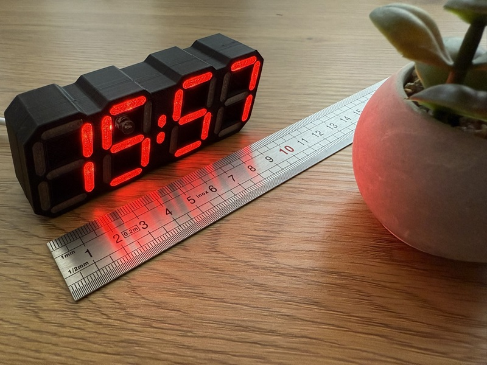 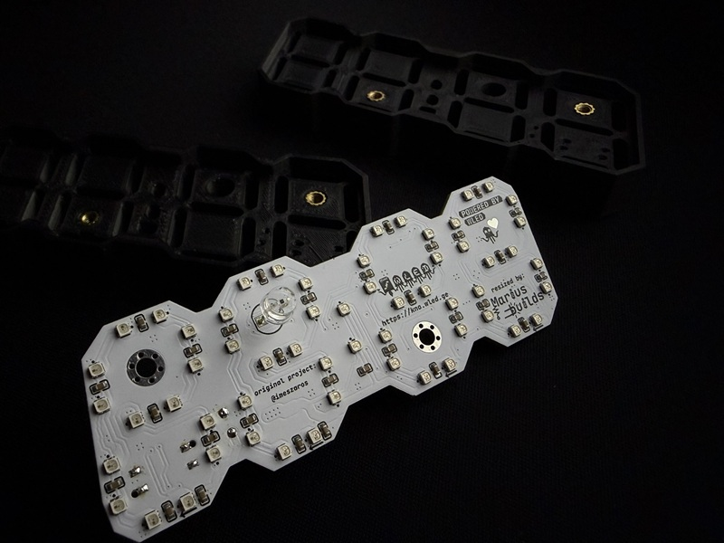 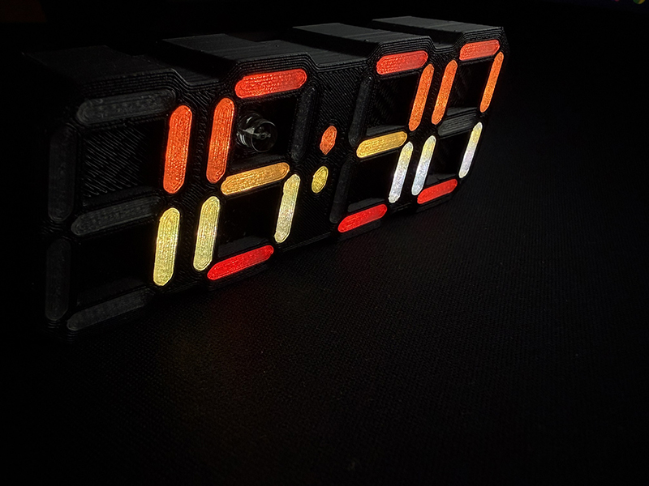 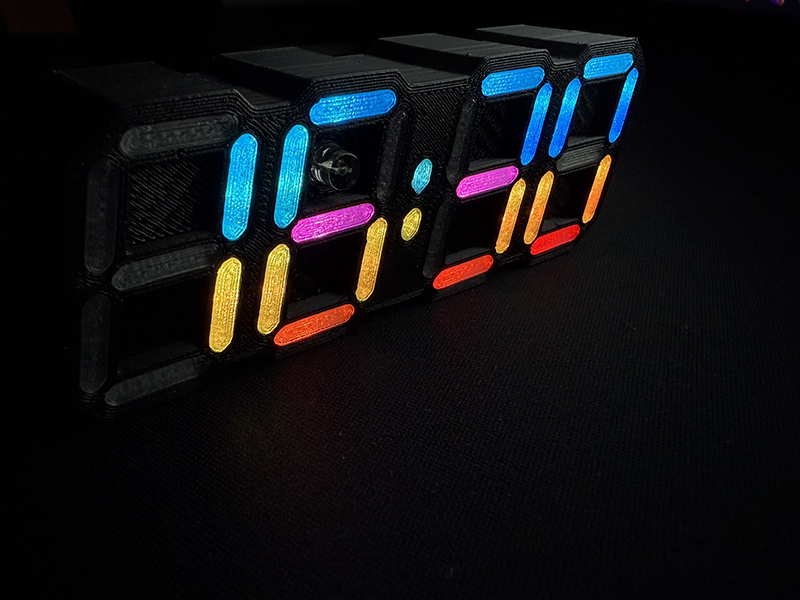

## Donate ☕

If you'd like to say thanks or buy me a coffee, a **[PayPal donation](https://www.paypal.com/donate/?hosted_button_id=KHR7DYJP2Z8QJ)** is always appreciated!
